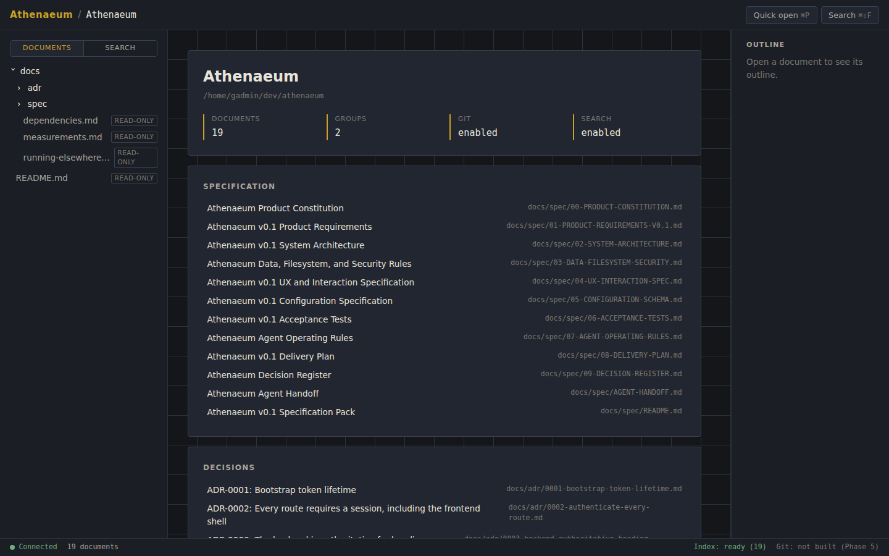
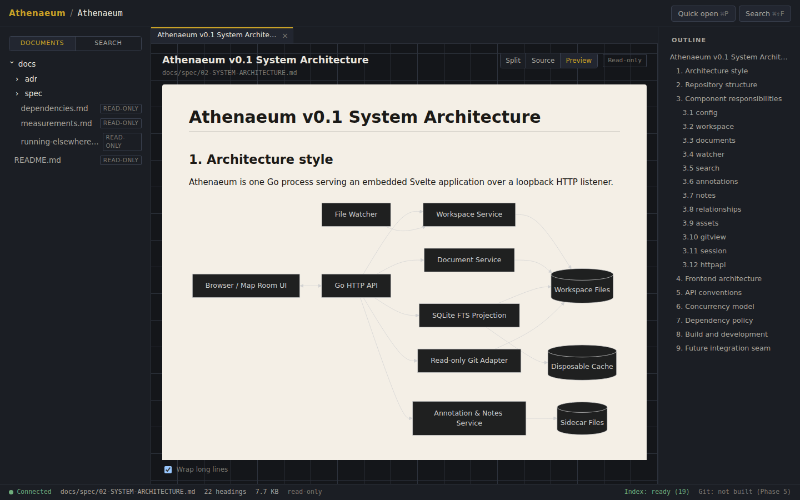
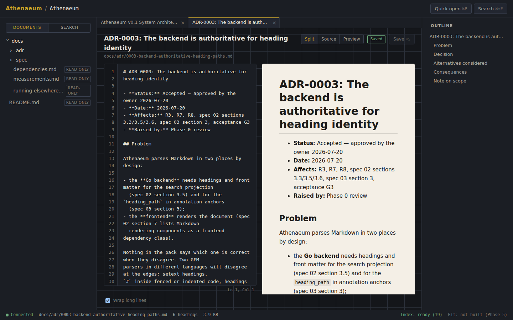
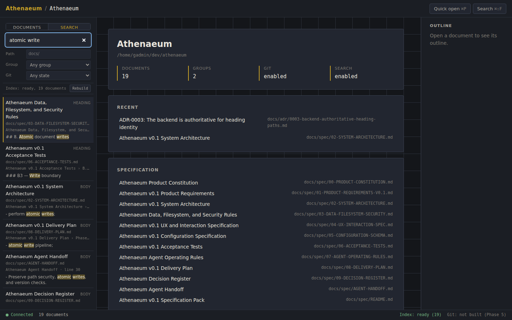

# Athenaeum

A lightweight, local-first developer command centre for reading, editing,
annotating, navigating, and understanding configured Markdown workspaces. The
primary workspace experience is called the **Map Room**.

Athenaeum is not a chat product, a memory system, a semantic knowledge graph, a
collaboration service, a cloud service, a WYSIWYG editor, or a Git client. It is
useful with no language model, no API key, and no internet connection.

**Status:** v0.1 in development. Phases 0 to 5 are complete: the repository
foundation, workspace loading and the read-only Map Room, editing with atomic
saves and crash recovery, workspace search with session restoration, the
annotation layer — anchored comments and pins with repair, personal and shared
notes, explicit relationships with backlinks, and Map Room summaries — and the
read-only Git panel: status, working-tree diff, history, and blame, through an
enforced allow-list that can reach no mutating command. Remote-mode hardening
and release packaging (Phase 6) remain.

Measured startup, responsiveness, and scale numbers are in
[docs/measurements.md](docs/measurements.md).

## Screenshots

The Map Room: file tree, document groups, recent documents, and configuration
diagnostics. No chat, no prompts, no generated summaries.



A rendered document. GitHub Flavoured Markdown with callouts, wiki links,
mathematics, syntax highlighting, and Mermaid diagrams — all sanitised, with
raw HTML off by default.



Split editing. Source on the left, live preview of the buffer on the right, so
unsaved work is visible before it reaches disk. Saves are atomic and
version-checked.



Workspace search. Lexical full-text search with snippets, matched-term
highlighting, and filters for path, document group, and Git state. The index is
a disposable cache: deleting it loses nothing.



## Requirements

- Go 1.26 or newer
- Node.js 22 or newer — build time only; the release binary needs neither
  Node.js nor npm
- `git` on PATH — optional. It supplies per-file state for the search Git
  filter, and the read-only Git panel in Phase 5. Without it, search works
  unchanged and the Git filter reports itself unavailable.

## Quick start

```bash
make deps     # install frontend dependencies
make build    # compile the frontend and embed it in bin/athenaeum
```

Athenaeum opens a folder of Markdown described by one `athenaeum.toml` beside
it. The smallest useful file is four lines:

```toml
schema_version = 1
name = "My Notes"
root = "."

include = ["**/*.md"]
```

Drop that next to your notes and open it:

```bash
./bin/athenaeum open athenaeum.toml
```

Athenaeum binds to loopback, prints a launch URL carrying a bootstrap token, and
opens your browser. Use `serve` instead of `open` to skip the browser.

To check a configuration before launching — it reports every problem at once,
naming the field and the remedy:

```bash
./bin/athenaeum validate athenaeum.toml
```

**[Configuration guide →](docs/configuration.md)** covers which documents appear,
which files Athenaeum may write to, where pasted images go, rendering features,
groups, and what to check when something is not working.

One setting is worth knowing up front: `security.writable`. Omit it and every
included document is editable. Set it and it becomes the complete list —
anything outside opens read-only, which is how you protect reference material
you want to read but never edit by accident.

## Commands

```text
athenaeum open     [path-to-athenaeum.toml]   start and open a browser
athenaeum serve    [path-to-athenaeum.toml]   start without opening a browser
athenaeum validate [path-to-athenaeum.toml]   check configuration and exit
athenaeum version                             print the build version
```

Flags may appear before or after the workspace path.

| Flag | Meaning |
|---|---|
| `--no-open` | Do not open a browser |
| `--bind <address>` | Address to bind (default `127.0.0.1`) |
| `--port <number>` | Port to bind (default `7777`; `0` chooses a free port) |
| `--remote` | Serve beyond loopback; requires `--bind` and `--auth-token-file` |
| `--auth-token-file <path>` | File holding the remote-mode token |
| `--log-level <level>` | `debug`, `info`, `warn`, or `error` |
| `--safe-mode` | Disable Git, remote assets, raw HTML, and Mermaid |

## Development

```bash
make dev      # Go API on :7777 and Vite on :5173 with hot reload
make test     # Go tests and frontend type-check
make lint     # go vet and gofmt
make test-acceptance   # acceptance scenarios against the built binary
make package  # cross-compiled release archives for macOS and Linux
```

`make dev` sets `ATHENAEUM_DEV_ORIGIN` so the Vite origin may issue mutating
requests. That variable is a development affordance only and is logged as a
warning whenever it is set.

## Repository layout

```text
cmd/athenaeum/     command entrypoint
internal/          application packages (see docs/spec/02-SYSTEM-ARCHITECTURE.md)
web/               Svelte + TypeScript frontend, embedded into the binary
examples/          fixture workspace used by acceptance tests
docs/spec/         the normative v0.1 specification pack
docs/adr/          architecture decision records
scripts/           exclusion checks and build helpers
test/acceptance/   acceptance scenarios run against a built binary
```

The Go module is named `athenaeum` rather than a hosting path because nothing
here is imported by other modules. Rename it in `go.mod` if that changes.

## Specification

`docs/spec/` is the normative build contract. Read it in the order given in
`docs/spec/README.md`. Implementation agents must also read
`docs/spec/07-AGENT-OPERATING-RULES.md` before making changes.

Locked decisions live in `docs/spec/09-DECISION-REGISTER.md` and may change only
through an ADR in `docs/adr/`.

## Security posture

- Binds to loopback by default; remote access requires `--remote`, an explicit
  bind address, and a token file, and fails startup without them.
- Every route except `/bootstrap` requires a session cookie
  (`HttpOnly`, `SameSite=Strict`).
- Mutating requests additionally require an allow-listed origin.
- A restrictive Content-Security-Policy is applied to every response.
- Authentication tokens are never written to logs.

## Licence

Apache-2.0. See `LICENSE`.
