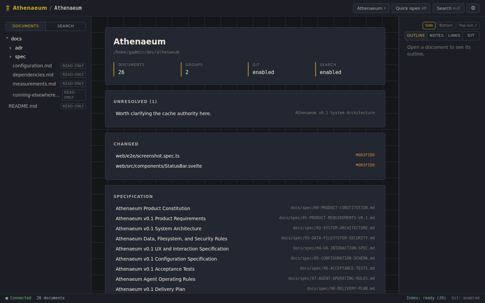
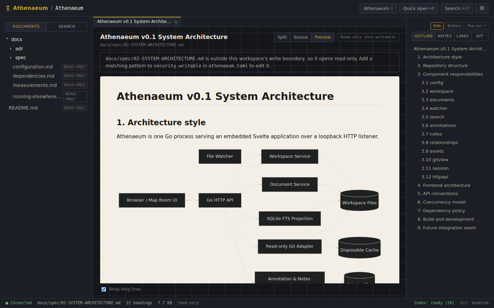
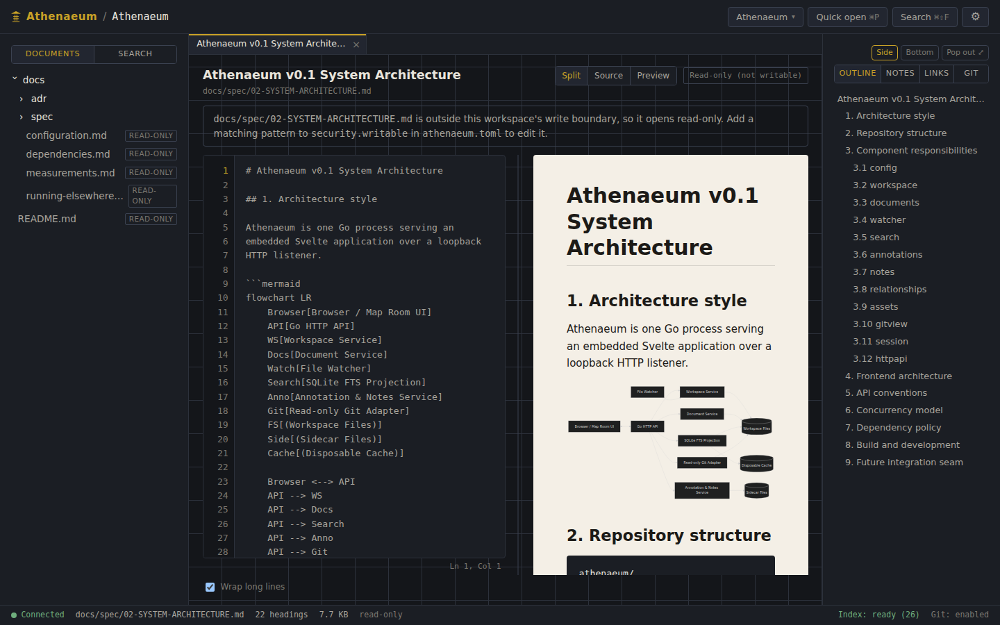
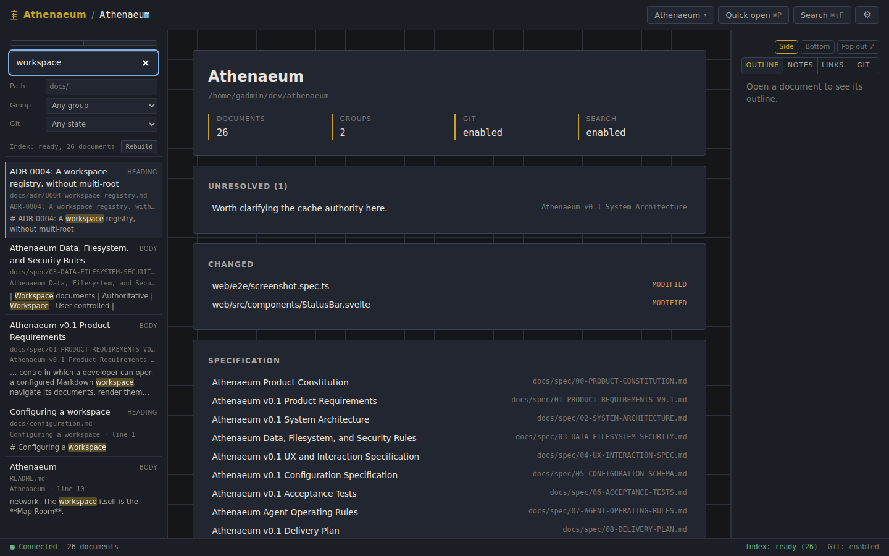
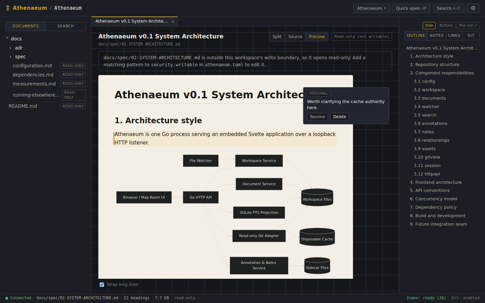

<p align="center">
  
</p>

# Athenaeum

**A local-first command centre for your Markdown.** Read, edit, search,
annotate, and navigate a folder of Markdown from a single binary — richly
rendered, with comments, notes, and backlinks. No language model, no API key, no
network. The workspace itself is the **Map Room**.

Athenaeum is deliberately *not* a chat product, a knowledge graph, a WYSIWYG
editor, or a cloud service. Your files stay plain Markdown on your disk —
authoritative, and yours.

```bash
curl -fsSL https://raw.githubusercontent.com/DesoCT/Athenaeum/main/scripts/install.sh | sh
```

## Highlights

- **Rich, safe rendering** — GitHub-Flavoured Markdown with callouts, math,
  Mermaid, wiki links, and syntax highlighting; sanitised, with raw HTML off by
  default.
- **Edit with confidence** — source and live preview side by side, atomic saves,
  crash recovery, and conflict protection when a file changes under you.
- **Annotate without touching your files** — comments and pins anchored to a
  selection or heading, personal or shared, that repair themselves after edits.
  Free-standing notes, too.
- **See the connections** — backlinks and outgoing links from Markdown, wiki,
  front-matter, and sidecar relationships. Nothing is ever inferred.
- **Read-only Git** — status, working-tree diff, history, and blame, through an
  allow-list that can reach no mutating command.
- **Fast, and local** — full-text search across thousands of documents, startup
  in tens of milliseconds, all offline with no account.

**Status:** v0.1, shipping as tagged alpha releases. Startup, responsiveness, and
scale numbers are in [docs/measurements.md](docs/measurements.md).

## Screenshots

The Map Room: file tree, document groups, recent documents, and configuration
diagnostics. No chat, no prompts, no generated summaries.



A rendered document. GitHub Flavoured Markdown with callouts, wiki links,
mathematics, syntax highlighting, and Mermaid diagrams — all sanitised, with
raw HTML off by default.



Split editing. Source on the left, live preview of the buffer on the right, so
unsaved work is visible before it reaches disk. Saves are atomic and
version-checked.



Workspace search. Lexical full-text search with snippets, matched-term
highlighting, and filters for path, document group, and Git state. The index is
a disposable cache: deleting it loses nothing.



Annotations. Comments anchored to a selection or heading, personal or shared,
shown in the margin — and never written into your Markdown. They repair
themselves after edits and detach rather than move when a match is lost.



Read-only Git. Working-tree diff, history, and blame for the open document,
through an allow-list that can reach no mutating command. Unresolved comments
and changed files also surface on the Map Room home.


## Requirements

The installed binary needs nothing but itself. These are for building from source:

- Go 1.26 or newer
- Node.js 22 or newer — build time only; the release binary needs neither
  Node.js nor npm
- `git` on PATH — optional. It powers the read-only Git panel and the search
  Git-state filter. Without it, everything else works unchanged and the Git
  features report themselves unavailable.

## Install

The one-liner above installs the newest release to `~/.local/bin/athenaeum` — no
Go, Node, or root — detecting your OS and architecture and clearing the macOS
quarantine so it runs without a Gatekeeper prompt. Set `ATHENAEUM_BIN` to install
elsewhere, or `ATHENAEUM_VERSION` to pin a version.

To build from source instead:

```bash
make deps     # install frontend dependencies
make build    # compile the frontend and embed it in bin/athenaeum
```

## Generate a config

Point the config generator at a directory and it inspects the tree to write a
validated `athenaeum.toml` — Markdown-scoped, build and dependency noise
excluded, and a document group per sub-directory that contains Markdown. It is
pure shell, so it runs anywhere `curl` and a POSIX shell do, with no clone:

```bash
curl -fsSL https://raw.githubusercontent.com/DesoCT/Athenaeum/main/scripts/athenaeum-config.sh -o athenaeum-config.sh
chmod +x athenaeum-config.sh

./athenaeum-config.sh ~/notes             # preview a config
./athenaeum-config.sh --write ~/notes     # write ~/notes/athenaeum.toml
./athenaeum-config.sh --help              # all options
```

A folder of repositories becomes a set of switchable workspaces (ADR-0004) in
one command — it writes a config into each and registers them:

```bash
./athenaeum-config.sh --write --registry ~/dev/*/
```

## Quick start

Athenaeum opens a folder of Markdown described by one `athenaeum.toml` beside
it. The smallest useful file is four lines:

```toml
schema_version = 1
name = "My Notes"
root = "."

include = ["**/*.md"]
```

Drop that next to your notes and open it:

```bash
./bin/athenaeum open athenaeum.toml
```

Athenaeum binds to loopback, prints a launch URL carrying a bootstrap token, and
opens your browser. Use `serve` instead of `open` to skip the browser.

To check a configuration before launching — it reports every problem at once,
naming the field and the remedy:

```bash
./bin/athenaeum validate athenaeum.toml
```

**[Configuration guide →](docs/configuration.md)** covers which documents appear,
which files Athenaeum may write to, where pasted images go, rendering features,
groups, and what to check when something is not working.

One setting is worth knowing up front: `security.writable`. Omit it and every
included document is editable. Set it and it becomes the complete list —
anything outside opens read-only, which is how you protect reference material
you want to read but never edit by accident.

## Commands

```text
athenaeum open       [path-to-athenaeum.toml]   start and open a browser
athenaeum serve      [path-to-athenaeum.toml]   start without opening a browser
athenaeum validate   [path-to-athenaeum.toml]   check configuration and exit
athenaeum workspaces                            list the workspace registry
athenaeum version                               print the build version
```

Without a path, `open` and `serve` use `./athenaeum.toml` when it exists, and
otherwise start at the workspace picker.

Flags may appear before or after the workspace path.

| Flag | Meaning |
|---|---|
| `--no-open` | Do not open a browser |
| `--pick` | Start at the workspace picker, ignoring `./athenaeum.toml` |
| `--registry <path>` | Workspace registry file (default `<user-config>/athenaeum/workspaces.toml`) |
| `--bind <address>` | Address to bind (default `127.0.0.1`) |
| `--port <number>` | Port to bind (default `7777`; `0` chooses a free port) |
| `--remote` | Serve beyond loopback; requires `--bind` and `--auth-token-file` |
| `--auth-token-file <path>` | File holding the remote-mode token |
| `--log-level <level>` | `debug`, `info`, `warn`, or `error` |
| `--safe-mode` | Disable Git, remote assets, raw HTML, Mermaid, and user overrides |

## Multiple workspaces

A session opens exactly one workspace, but you can register several and switch
between them — a launcher, not a multi-root view (ADR-0004). List them in
`<user-config>/athenaeum/workspaces.toml`, which Athenaeum only ever reads:

```toml
[[workspace]]
name = "Athenaeum"
path = "~/dev/athenaeum"

[[workspace]]
name = "Field notes"
path = "~/notes"
```

Run `athenaeum` with no local `athenaeum.toml` to land on the picker, or
`athenaeum workspaces` to list them without a browser. In the app, the
**Workspaces** menu in the command bar switches between them. The config
generator writes this file for you with `--registry` (see above).

## Development

```bash
make dev      # Go API on :7777 and Vite on :5173 with hot reload
make test     # all Go and frontend tests
make lint     # go vet and gofmt
make test-acceptance   # acceptance scenarios against the built binary
make package  # cross-compiled release archives for macOS and Linux
```

`make dev` sets `ATHENAEUM_DEV_ORIGIN` so the Vite origin may issue mutating
requests. That variable is a development affordance only and is logged as a
warning whenever it is set.

## Repository layout

```text
cmd/athenaeum/     command entrypoint
internal/          application packages (see docs/spec/02-SYSTEM-ARCHITECTURE.md)
web/               Svelte + TypeScript frontend, embedded into the binary
examples/          fixture workspace used by acceptance tests
docs/spec/         the normative v0.1 specification pack
docs/adr/          architecture decision records
scripts/           install and config-generator scripts, exclusion checks, build helpers
test/acceptance/   acceptance scenarios run against a built binary
```

The Go module is named `athenaeum` rather than a hosting path because nothing
here is imported by other modules. Rename it in `go.mod` if that changes.

## Specification

`docs/spec/` is the normative build contract. Read it in the order given in
`docs/spec/README.md`. Implementation agents must also read
`docs/spec/07-AGENT-OPERATING-RULES.md` before making changes.

Locked decisions live in `docs/spec/09-DECISION-REGISTER.md` and may change only
through an ADR in `docs/adr/`.

## Security posture

- Binds to loopback by default; remote access requires `--remote`, an explicit
  bind address, and a token file, and fails startup without them.
- Every route except `/bootstrap` requires a session cookie
  (`HttpOnly`, `SameSite=Strict`).
- Mutating requests additionally require an allow-listed origin.
- A restrictive Content-Security-Policy is applied to every response.
- Authentication tokens are never written to logs.

## Licence

Apache-2.0. See `LICENSE`.
