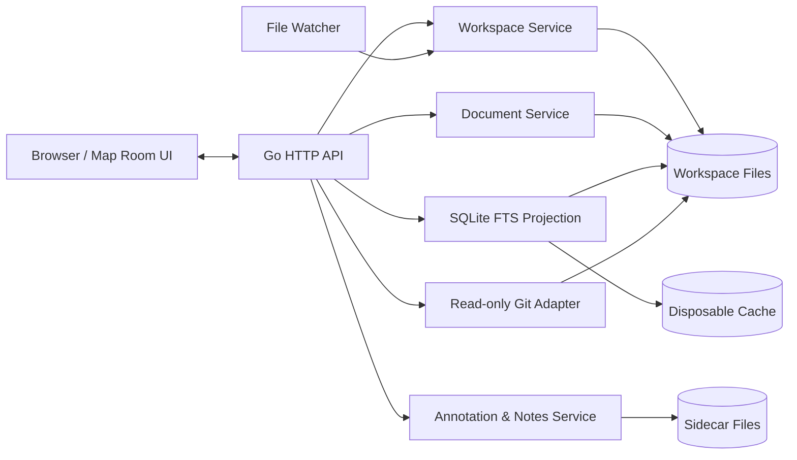

# Athenaeum v0.1 System Architecture

## 1. Architecture style

Athenaeum is one Go process serving an embedded Svelte application over a loopback HTTP listener.



## 2. Repository structure

```text
athenaeum/
├── cmd/athenaeum/
│   └── main.go
├── internal/
│   ├── app/
│   ├── config/
│   ├── workspace/
│   ├── documents/
│   ├── watcher/
│   ├── search/
│   ├── annotations/
│   ├── notes/
│   ├── relationships/
│   ├── assets/
│   ├── gitview/
│   ├── session/
│   ├── security/
│   └── httpapi/
├── web/
│   ├── src/
│   └── dist/
├── schemas/
├── docs/
├── examples/
├── go.mod
├── Makefile
└── LICENSE
```

A future integration package may be added under `internal/integrations/`, but v0.1 MUST NOT contain a provider implementation.

## 3. Component responsibilities

### 3.1 `config`

- discover project config;
- load user overrides;
- merge only approved override fields;
- validate paths and patterns;
- return immutable effective configuration;
- expose redacted configuration diagnostics.

### 3.2 `workspace`

- enumerate included documents;
- apply exclusions;
- canonicalise paths;
- enforce root and write boundaries;
- expose stable document identifiers;
- coordinate watcher events.

Stable document ID in v0.1 is the slash-normalised, case-preserving path relative to the canonical workspace root. Filesystem comparisons MUST follow platform case rules.

### 3.3 `documents`

- read file bytes;
- detect UTF-8 and line endings;
- parse front matter and headings;
- maintain open-buffer versions;
- perform atomic writes;
- preserve recovery buffers;
- produce document metadata.

v0.1 supports UTF-8 Markdown. Non-UTF-8 files open read-only with an explanatory warning.

### 3.4 `watcher`

- subscribe to filesystem changes;
- debounce duplicate events;
- compare content fingerprints rather than trusting event order;
- classify self-writes versus external writes;
- notify document and index services.

The watcher is advisory. Correctness MUST also use file metadata and content hashes.

### 3.5 `search`

- maintain a disposable SQLite FTS projection;
- index path, title, headings, body, tags, and document group;
- update incrementally;
- rebuild on schema or config version change;
- expose search status and rebuild progress.

The index MUST live under the operating-system cache directory, not inside the repository.

### 3.6 `annotations`

- read and write personal/shared annotation sidecars;
- repair anchors after document changes;
- preserve detached annotations;
- apply optimistic version checks;
- never modify document source.

### 3.7 `notes`

- manage free-standing Markdown notes;
- maintain personal/shared separation;
- expose link targets;
- use the same atomic-write policy as documents.

### 3.8 `relationships`

- parse explicit source links;
- parse approved front-matter fields;
- read sidecar links;
- compute backlinks as a projection;
- avoid semantic inference.

### 3.9 `assets`

- validate destination under approved write boundary;
- normalise filenames;
- detect collisions;
- write atomically;
- return relative Markdown reference.

### 3.10 `gitview`

- locate repository root;
- execute an allow-listed set of `git` commands;
- never invoke a shell;
- enforce timeouts;
- parse output;
- return unavailable state when Git is absent.

Allowed command families:

- `git status --porcelain=v2`;
- `git diff` without mutation flags;
- `git log` scoped to a file;
- `git blame` scoped to a file.

### 3.11 `session`

- persist UI/session state outside the repository;
- maintain crash-recovery buffers;
- expire stale recovery data only after a successful clean close or explicit user action.

### 3.12 `httpapi`

- expose versioned JSON endpoints under `/api/v1`;
- validate request sizes and paths;
- apply CSRF/session-token protections;
- emit stable error objects;
- serve the embedded frontend for non-API routes.

## 4. Frontend architecture

The frontend uses Svelte and TypeScript.

Suggested modules:

```text
web/src/
├── app/
├── api/
├── stores/
├── components/
├── map-room/
├── editor/
├── renderer/
├── search/
├── annotations/
├── notes/
├── git/
├── commands/
└── styles/
```

Core UI state is explicit and serialisable. Server state is accessed through typed API clients. The frontend MUST NOT read the filesystem directly.

## 5. API conventions

Error shape:

```json
{
  "error": {
    "code": "DOCUMENT_CONFLICT",
    "message": "The file changed on disk while local edits were unsaved.",
    "details": {
      "document_id": "docs/architecture.md"
    }
  }
}
```

Write requests MUST include the last observed document or sidecar version. A stale version returns HTTP 409.

Representative endpoints:

```text
GET    /api/v1/workspace
GET    /api/v1/documents
GET    /api/v1/documents/{id}
PUT    /api/v1/documents/{id}
POST   /api/v1/documents/{id}/resolve-conflict
GET    /api/v1/search
GET    /api/v1/annotations
POST   /api/v1/annotations
PATCH  /api/v1/annotations/{id}
DELETE /api/v1/annotations/{id}
GET    /api/v1/notes
POST   /api/v1/notes
GET    /api/v1/relationships/{id}
POST   /api/v1/assets
GET    /api/v1/git/status
GET    /api/v1/git/diff/{id}
GET    /api/v1/git/history/{id}
GET    /api/v1/git/blame/{id}
GET    /api/v1/health
```

Exact endpoint schemas should be generated from Go types and checked into the repository as OpenAPI after the initial vertical slice.

## 6. Concurrency model

- HTTP handlers MUST not perform long indexing or Git work inline.
- Indexing uses a bounded worker pool.
- Each document has a logical serialisation key for writes.
- SQLite writes use one controlled writer; reads may use a small pool.
- Watcher events are debounced and coalesced by document ID.
- Cancellation propagates from HTTP requests and application shutdown.

## 7. Dependency policy

A new production dependency requires:

- documented purpose;
- licence compatibility;
- maintenance and security review;
- evidence that the standard library or existing dependency is insufficient;
- tests at the abstraction boundary.

Preferred dependency classes:

- TOML parser;
- file watcher;
- pure-Go SQLite driver with FTS support;
- Markdown parsing/rendering components in the frontend;
- editor component;
- sanitiser;
- syntax highlighter;
- Mermaid and math rendering loaded only where needed.

## 8. Build and development

Release:

```text
frontend build -> web/dist -> go:embed -> athenaeum executable
```

Development:

- Go API with live reload;
- Vite dev server with hot module reload;
- explicit dev-origin allow-list;
- fixture workspace for integration tests.

Release commands SHOULD converge on:

```bash
make test
make dev
make build
make package
```

## 9. Future integration seam

A future external knowledge integration must be designed from owner-supplied documentation. At most, v0.1 may define an empty internal boundary such as:

```go
type KnowledgeProvider interface{}
```

Even that SHOULD be omitted until a real contract exists. YAGNI takes precedence over speculative abstraction.
