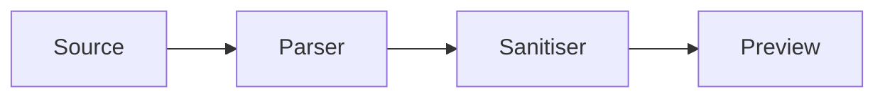

# Rendering notes

This document carries one of every dialect feature named in R3, so acceptance
test C1 has something concrete to assert against.

## Table

| Feature   | Enabled by      | Phase |
| --------- | --------------- | ----- |
| Tables    | GFM baseline    | 1     |
| Callouts  | `callouts`      | 1     |
| Mermaid   | `mermaid`       | 1     |

## Task list

- [x] Write the fixture
- [ ] Render it (Phase 1)
- [ ] Index it (Phase 3)

## Strikethrough and footnotes

Athenaeum ~~infers~~ reads relationships explicitly.[^why]

[^why]: Inference is excluded from v0.1 by D-018.

## Code

```go
func Render(source []byte) ([]byte, error) {
    return sanitise(markdown(source))
}
```

## Wiki link

A wiki link to [[docs/operations/runbook]] resolves when `wiki_links` is on.

## Callout

> [!NOTE]
> Callouts render only when `documents.callouts` is enabled.

## Mermaid



## Mathematics

Inline $E = mc^2$ and display:

$$
\sum_{i=1}^{n} w_i x_i
$$
